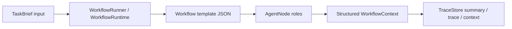

# AgentFlow Runtime

Reusable feasibility-aware workflow templates for coding agents.

AgentFlow Runtime is a TypeScript/Node.js MVP for composing structured agent roles into deterministic, traceable workflows. The runtime controls graph execution from JSON templates, while role nodes such as `Researcher`, `FeasibilityEvaluator`, `Planner`, `Executor`, `Verifier`, and `GoalKeeper` exchange structured context instead of free-form chat.

The project is designed to be cloned and run locally. It defaults to mock LLM behavior, so demos and tests do not require API keys or external model calls.

## What It Does

- Runs configurable workflow templates from `workflows/*.json`.
- Provides reusable role presets from `roles/*.json`.
- Supports TaskBrief inputs from `inputs/*.json`.
- Gates execution with `ResearchReport` and `FeasibilityReport`.
- Validates every node output before writing to context.
- Persists workflow traces under `.workflow-runs/`.
- Supports mock execution by default.
- Supports opt-in OpenAI-compatible and DeepSeek providers for `type: "llm"` nodes.
- Includes opencode commands, custom tools, and a policy plugin adapter.
- Includes policy audit, approval, replay, and replay-history utilities.

## Requirements

- Node.js with support for `--experimental-strip-types`.
- npm.

No install step is required for the TypeScript runtime because the project currently uses Node built-ins only.

## Quick Start

See `QUICKSTART.md` for a step-by-step guide.

```bash
git clone <your-repo-url>
cd <repo>

npm run demo
npm run workflow:list
npm run workflow -- --template research-feasibility-execute-verify --input inputs/feasible-task.json
npm run test
npm run typecheck
```

Expected default behavior:

- `npm run demo` runs a mock Planner -> Debater -> PlannerRevision -> Executor -> Verifier loop.
- `npm run workflow:list` lists reusable templates in `workflows/`.
- `npm run test` runs the local test suite without external APIs.

## Core Concepts



See `ARCHITECTURE.md` for the full architecture overview.

### Workflow Runtime

`WorkflowRuntime` is deterministic. It does not decide role behavior and does not hardcode workflow order. It only:

- loads configured nodes and edges;
- calls the registered executor for each node;
- validates output schemas;
- writes structured output to context;
- resolves the next edge condition;
- stops on `end` or `maxIterations`;
- records trace entries.

### Workflow Templates

Templates live in `workflows/`.

Important examples:

- `research-feasibility-execute-verify`: Researcher -> FeasibilityEvaluator -> execution flow only if feasible.
- `abcde-basic`: Planner -> Debater -> PlannerRevision -> Executor -> Verifier -> GoalKeeper loop.
- `abcde-basic-llm`: opt-in LLM node version. It is not used by default.
- `code-test-verify`: controlled CodeExecutor -> TestRunner -> deterministic Verifier.

Run a template:

```bash
npm run workflow -- --template abcde-basic --input inputs/feasible-task.json
```

Run the controlled code/test/verify template:

```bash
npm run workflow -- --template code-test-verify --input inputs/feasible-task.json
```

`code-test-verify` uses a `type: "verify"` node. Its deterministic verifier checks code execution status, configured test results, blocked operations, changed/deleted files, diff limits, unsafe paths, and checkpoint evidence before marking the workflow as passed.

When verification fails, the template now routes to `repairPlanBuilder -> humanApprovalGate -> end`. That branch creates a scoped repair plan and a pending human approval request only; it does not automatically rerun `CodeExecutor`.

### Scoped Repair Plans

`ScopedRepairPlan` turns failed verification evidence into a bounded review artifact. It lists failure codes, failed criteria, target files, forbidden files, proposed inspect/modify/test/manual-review operations, test commands, risk level, and safety notes.

The plan is never executed automatically. `HumanApprovalGate` creates a `HumanApprovalRequest` with `status: "pending"` and `blockedUntilApproved: true`; it does not approve itself and it does not loop back into code execution.

Validate and inspect templates:

```bash
npm run workflow:validate -- --template abcde-basic
npm run workflow:inspect -- --template abcde-basic
```

## TaskBrief Inputs

TaskBrief files live in `inputs/`.

Example shape:

```json
{
  "taskId": "task_example",
  "goal": "Add a reusable workflow template runner.",
  "currentState": "The runtime and mock LLM are already implemented.",
  "constraints": ["Do not call real LLMs", "Do not build UI"],
  "resources": ["TypeScript runtime", "MockLLMClient"],
  "budget": "low",
  "successCriteria": ["Can run by template and input", "Tests pass"],
  "nonGoals": ["Coding executor", "UI"]
}
```

## Role Catalog

Reusable role definitions live in `roles/`.

List roles:

```bash
npm run workflow:roles
```

Create a template from a simpler spec:

```bash
npm run workflow:create -- --spec template-specs/abcde-basic.json --out workflows/my-template.json --name my-template
```

By default, `workflow:create` refuses to overwrite existing files. Use `--force` only when you intentionally want to replace the output file.

## LLM Providers

The default provider is `mock`. You do not need any key for demos or tests.

Check active sanitized config:

```bash
npm run llm:config
npm run llm:config -- --provider deepseek
```

Dry-run a provider smoke test without network access:

```bash
npm run llm:smoke
npm run llm:smoke -- --provider deepseek
```

Do not run execute mode unless you intentionally want a real external API call:

```bash
AGENTFLOW_LLM_PROVIDER=deepseek \
AGENTFLOW_DEEPSEEK_API_KEY=replace-with-your-key \
AGENTFLOW_DEEPSEEK_MODEL=deepseek-v4-flash \
npm run llm:smoke -- --provider deepseek --execute
```

LLM details:

- OpenAI-compatible providers use `/chat/completions`.
- DeepSeek is first-class and reuses the OpenAI-compatible client.
- DeepSeek default model is `deepseek-v4-flash`.
- API keys are read from environment variables and must not be committed.
- See `docs/LLM_ADAPTER.md` for full details.

## opencode Adapter

The core runtime is independent. opencode is only an adapter layer.

Included files:

- `.opencode/commands/workflow.md`
- `.opencode/commands/workflow-inspect.md`
- `.opencode/commands/workflow-create.md`
- `.opencode/tools/run-workflow.ts`
- `.opencode/tools/list-workflows.ts`
- `.opencode/tools/inspect-workflow.ts`
- `.opencode/tools/validate-workflow.ts`
- `.opencode/tools/create-workflow.ts`
- `.opencode/plugins/agentflow-policy.ts`

Check adapter files:

```bash
npm run opencode:check
```

See `docs/OPENCODE_ADAPTER.md` for usage and limitations.

## Policy Audit And Replay

The opencode policy adapter can classify high-risk operations and write audit records. Runtime policy output is stored under `.opencode/policy-runs/`, which is ignored by git.

Useful commands:

```bash
npm run policy:audit
npm run policy:pending
npm run policy:approve -- --id <decisionId> --note "Approved exact action."
npm run policy:reject -- --id <decisionId> --note "Rejected."
npm run policy:replay-check -- --id <decisionId>
npm run policy:replay-history -- --id <decisionId>
```

Approval does not automatically execute anything. Replay is dry-run by default and only supports exact approved tool calls.

## Repository Layout

```text
core/                  independent workflow runtime and LLM adapter
cli/                   command-line entrypoints
workflows/             reusable workflow templates
roles/                 reusable role presets
template-specs/        simplified template scaffolding specs
inputs/                sample TaskBrief inputs
prompts/roles/         role prompts for LLM nodes
adapters/opencode/     opencode service adapters and policy services
.opencode/             opencode commands, tools, and plugin adapter
docs/                  policy, LLM, and opencode documentation
tests/                 node:test test suite
examples/              older example workflow configs
```

## Release Readiness

Before publishing to GitHub, run:

```bash
npm run release:check
npm run test
npm run typecheck
```

The release check verifies that ignored runtime directories are configured, required public docs exist, and candidate repository files do not contain local absolute paths or obvious real secrets.

See `docs/GITHUB_RELEASE_CHECKLIST.md` for the full pre-push checklist.

Contributing and security docs:

- `CONTRIBUTING.md`
- `SECURITY.md`
- `CHANGELOG.md`

Do not commit:

- `.env`
- `.workflow-runs/`
- `.opencode/policy-runs/`
- `.opencode/opencode.db*`
- `node_modules/`
- `dist/`
- `coverage/`
- local runtime databases or logs

## Current Limits

- Coding Executor is controlled and allowlist-based; it is not arbitrary shell execution.
- Code verification is rule-based and does not infer semantic correctness beyond execution evidence and rule-checkable criteria.
- Verification failure creates a scoped repair plan and approval request, but does not execute repairs automatically.
- No UI.
- No automatic external LLM calls.
- Real LLM usage is opt-in through `type: "llm"` templates and explicit environment configuration.
- The policy plugin uses static classification, not a complete shell parser.

## License

MIT. See `LICENSE`.
