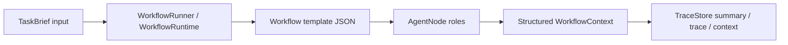

# AgentFlow Runtime

Reusable feasibility-aware workflow templates for coding agents.

AgentFlow Runtime is a TypeScript/Node.js MVP for composing structured agent roles into deterministic, traceable workflows. The runtime controls graph execution from JSON templates, while role nodes such as `Researcher`, `FeasibilityEvaluator`, `Planner`, `Executor`, `Verifier`, and `GoalKeeper` exchange structured context instead of free-form chat.

The project is designed to be cloned and run locally. It defaults to mock LLM behavior, so demos and tests do not require API keys or external model calls.

## What It Does

- Runs configurable workflow templates from `workflows/*.json`.
- Provides reusable role presets from `roles/*.json`.
- Supports TaskBrief inputs from `inputs/*.json`.
- Gates execution with `ResearchReport` and `FeasibilityReport`.
- Validates every node output before writing to context.
- Persists workflow traces under `.workflow-runs/`.
- Supports mock execution by default.
- Supports opt-in OpenAI-compatible and DeepSeek providers for `type: "llm"` nodes.
- Includes opencode commands, custom tools, and a policy plugin adapter.
- Includes policy audit, approval, replay, and replay-history utilities.

## Requirements

- Node.js with support for `--experimental-strip-types`.
- npm.

No install step is required for the TypeScript runtime because the project currently uses Node built-ins only.

## Quick Start

See `QUICKSTART.md` for a step-by-step guide.

```bash
git clone <your-repo-url>
cd <repo>

npm run demo
npm run workflow:list
npm run workflow -- --template research-feasibility-execute-verify --input inputs/feasible-task.json
npm run test
npm run typecheck
```

Expected default behavior:

- `npm run demo` runs a mock Planner -> Debater -> PlannerRevision -> Executor -> Verifier loop.
- `npm run workflow:list` lists reusable templates in `workflows/`.
- `npm run test` runs the local test suite without external APIs.

## Core Concepts



See `ARCHITECTURE.md` for the full architecture overview.

### Workflow Runtime

`WorkflowRuntime` is deterministic. It does not decide role behavior and does not hardcode workflow order. It only:

- loads configured nodes and edges;
- calls the registered executor for each node;
- validates output schemas;
- writes structured output to context;
- resolves the next edge condition;
- stops on `end` or `maxIterations`;
- records trace entries.

### Workflow Templates

Templates live in `workflows/`.

Important examples:

- `research-feasibility-execute-verify`: Researcher -> FeasibilityEvaluator -> execution flow only if feasible.
- `task-negotiation`: TaskNegotiator -> end; clarifies goal, target module, constraints, and human confirmation needs before feasibility or planning.
- `abcde-basic`: Planner -> Debater -> PlannerRevision -> Executor -> Verifier -> GoalKeeper loop.
- `abcde-basic-llm`: opt-in LLM node version. It is not used by default.
- `agent-workforce-task-solving`: Planner -> Debater -> PlannerRevision -> Executor -> Verifier for deliverable-centered general answers.
- `code-test-verify`: controlled CodeExecutor -> TestRunner -> deterministic Verifier.

Run a template:

```bash
npm run workflow -- --template abcde-basic --input inputs/feasible-task.json
```

Run the controlled code/test/verify template:

```bash
npm run workflow -- --template code-test-verify --input inputs/feasible-task.json
```

`code-test-verify` uses a `type: "verify"` node. Its deterministic verifier checks code execution status, configured test results, blocked operations, changed/deleted files, diff limits, unsafe paths, and checkpoint evidence before marking the workflow as passed.

When verification fails, the template now routes to `repairPlanBuilder -> humanApprovalGate -> end`. That branch creates a scoped repair plan and a pending human approval request only; it does not automatically rerun `CodeExecutor`.

### Workflow Profiles

Profiles live in `profiles/` and define the current working mode for `/workflow`. `profiles/current.json` selects the active profile, so users do not need to repeat standing safety rules, default workflows, policy files, or memory files on every request.

```bash
npm run workflow:profiles
npm run workflow:profile
npm run workflow:profile:use -- --profile rag-optimization
npm run workflow:profile:inspect -- --profile rag-optimization
```

Built-in profiles:

- `rag-optimization`: starts with `task-negotiation`, uses `confirmed-scope-gate`, then proceeds to feasibility. It blocks production index changes, deployment, deletion, and unconfirmed metric changes.
- `coding-safe-fix`: defaults to the controlled code/test/verify and approval chain for small scoped fixes.
- `external-project-fix`: copies external projects into temporary workspaces and exports patches for manual review.
- `frontend-site-build`: handles single-page websites, landing pages, personal sites, HTML/CSS/JS, and lightweight React or Next.js page work. It starts with negotiation and does not deploy, delete files, call real LLMs, or execute code changes by default.
- `task-solving`: handles explanations, definitions, how-to answers, and conceptual help. It preserves `userRequest`, sets `expectedDeliverable`, and verifies the actual deliverable rather than workflow metadata.
- `agent-workforce-basic`: runs `abcde-basic` to visibly demonstrate Planner, Debater, PlannerRevision, Executor, Verifier, and GoalKeeper as runtime-traced roles.
- `agent-workforce-llm`: opt-in profile for the same visible workforce using `abcde-basic-llm` LLM nodes. Do not run it without explicit real LLM configuration.

The opencode `/workflow` command and `workflow:run-profile` use a rule-based profile router before choosing a default workflow. If `profiles/current.json` points to `rag-optimization` but the user asks for a Claude.ai-style personal website, the runner records `detectedTaskType=frontend_site_build`, recommends `frontend-site-build`, and can safely auto-switch when the user did not explicitly choose a profile. See `docs/WORKFLOW_PROFILES.md`.

Run the active profile directly from CLI:

```bash
npm run workflow:route-profile -- --task "做一个仿 Claude.ai 风格的个人网站"
npm run workflow:run-profile -- --task "继续 RAG 召回优化，分析上一轮实验结果，给出下一步方案"
npm run demo:task-solving-coffee
npm run workflow:run-profile -- --profile rag-optimization --task "..."
```

The first implementation runs only safe pre-execution profile steps by default. It will not run CodeExecutor, tests, execution workflows, or real LLM calls unless a later explicit execution path is used.

The text output is formatted by the profile runner and includes `Routing Decision`, `Autonomy Decision`, `AgentFlow Role Timeline`, artifact paths, warnings, and next actions. The opencode `/workflow` command should show this runtime result instead of exposing its internal command protocol.

Role timelines are runtime-verified: no trace, no agent. A role appears only when it is present in `trace.json` with `source=runtime_trace`. Each row shows `nodeType`, `executorType`, `isMock`, and `isLLMBacked`, so mock simulations cannot be mistaken for LLM-backed agents. To demonstrate the full multi-agent workforce:

```bash
npm run workflow:run-profile -- --profile agent-workforce-basic --task "演示 Planner、Debater、Executor、Verifier 多角色协作"
npm run mcp:agentflow:smoke
```

See `docs/RUNTIME_VERIFIED_AGENTS.md`.

For task-solving runs, the Role Timeline also shows subagent dispatch artifact paths, Executor deliverable summaries, and Verifier fidelity flags such as `answersUserRequest` and `isNotMetaOnly`. See `docs/TASK_FIDELITY.md`.

OpenCode should call AgentFlow through the MCP tool `agentflow_run_profile_workflow`, which returns the same runtime proof and role timeline.

Inspect the opt-in LLM workforce profile without calling a model:

```bash
npm run workflow:profile:inspect -- --profile agent-workforce-llm
```

Profile runs create resumable sessions when scope confirmation is needed:

```bash
npm run workflow:profile:sessions
npm run workflow:profile:session -- --id <sessionId>
npm run workflow:run-profile -- --sessionId <sessionId> --answer "按 heading/file 口径评估，不改生产索引，可以做 query rewrite 和 reranker 实验。"
```

The resume step turns the answer into a `ScopeConfirmationRecord`, runs `confirmed-scope-gate`, and continues only inside the active profile's safe chain.

Confirmed scopes and profile routes are also written into local Project Memory:

```bash
npm run memory:list -- --profile rag-optimization
npm run memory:summary -- --profile rag-optimization
npm run memory:compact -- --profile rag-optimization
npm run memory:autonomy -- --profile rag-optimization --task "continue RAG optimization"
npm run memory:show -- --id <memoryId>
```

Project Memory records confirmed boundaries, decisions, tried routes, rejected routes, and next actions under `.agentflow/project-memory/`. Later profile runs load recent memory summaries so `/workflow` can avoid asking the user to repeat the same confirmed scope and avoid retrying known blocked routes.

`memory:compact` produces a conflict-aware compact summary with current facts, active decisions, rejected routes, open questions, resolved questions, and next actions. It is local and deterministic; no LLM is called.

`memory:autonomy` evaluates a proposed task against compacted memory. High-severity conflicts, blocking open questions, and rejected-route repeats block continuation before the profile runner proceeds.

### Task Negotiation

`task-negotiation` is a pre-flight workflow for complex or ambiguous requests. It produces a `TaskNegotiationResult` with detected task type, target module, ambiguities, clarification questions, proposed allowed/forbidden scope, suggested task breakdown, and a recommended next step.

```bash
npm run demo:task-negotiation
```

The negotiator does not plan implementation, write files, run tests, call `CodeExecutor`, or run real LLMs. If scope or module boundaries are unclear it returns `recommendedNextStep: "ask_human"` or `split_task`, so the human can confirm the boundary before feasibility analysis or execution.

### Scope Confirmation Gate

`ScopeConfirmationRecord` is the explicit human-confirmed boundary for a negotiated task. It records allowed modules, forbidden modules, allowed actions, blocked actions, quality constraints, user answers, accepted assumptions, and optional RAG metrics/constraints.

```bash
npm run demo:scope-confirmation
npm run scope:list
npm run scope:show -- --id <confirmationId>
npm run scope:gate -- --id <confirmationId>
```

`confirmed-scope-gate` only allows continuation when the confirmation is `confirmed`, unexpired, complete, and bound to the negotiation. A `TaskNegotiationResult` alone is not confirmation. The gate does not execute code, run tests, call `CodeExecutor`, or call a real LLM.

### Scoped Repair Plans

`ScopedRepairPlan` turns failed verification evidence into a bounded review artifact. It lists failure codes, failed criteria, target files, forbidden files, proposed inspect/modify/test/manual-review operations, test commands, risk level, and safety notes.

The plan is never executed automatically. `HumanApprovalGate` creates a `HumanApprovalRequest` with `status: "pending"` and `blockedUntilApproved: true`; it does not approve itself and it does not loop back into code execution.

### Approved Repair Materialization

After a human records an approved repair decision, `approved-repair-materialize` can convert the approved `ScopedRepairPlan` into a safe `CodeChangePlan`. The materialized plan is still non-executable: it only records scoped operations, target files, tests, safety checks, and the requirement for another explicit execution approval.

```bash
npm run demo:approved-repair-materialize
```

### Explicit Execution Approval

`code-change-plan-execution-approval` creates a pending execution approval request for a materialized `CodeChangePlan`. The request is bound to a stable `codeChangePlanHash`, keeps `blockedUntilApproved: true`, and records target files, operation count, risk level, and test commands.

This stage still does not execute anything. It does not write files, run commands, run tests, call `CodeExecutor`, or approve itself.

Pending approval is not execution authorization. The hash binding prevents approving one `CodeChangePlan` and later substituting a different plan for execution.

```bash
npm run demo:code-change-plan-execution-approval
```

### Approved Execution Dry-run

`code-change-plan-execution-dry-run` takes a `CodeChangePlan` plus an approved `CodeChangePlanExecutionApprovalRecord`, verifies the `codeChangePlanHash`, checks scope and command safety, and produces a dry-run execution plan.

The dry-run still does not execute. It does not write files, run commands, run tests, call `CodeExecutor`, consume approval, or change approval status.

```bash
npm run demo:code-change-plan-execution-dry-run
```

### Approved CodeChangePlan Execution

`code-change-plan-execution` is the first explicit execution workflow for an approved `CodeChangePlan`. It rechecks approval status, `codeChangePlanHash`, scoped target files, forbidden files, operation content, and test commands before doing anything.

When checks pass, it creates a checkpoint, applies only declared `create_file` / `modify_file` operations through `CodeExecutor`, runs the plan's `testCommands` through `TestRunner`, verifies the result with the execution-aware verifier, records a rollback guide, and consumes the approval exactly once with `consumedByExecutionId`.

It still does not support `delete_file`, high-risk shell, automatic approval, infinite retry loops, or destructive rollback.

```bash
npm run demo:code-change-plan-execution
```

Execution records are persisted under `.agentflow/executions/` for local audit and are ignored by Git:

```bash
npm run execution:list
npm run execution:show -- --id <executionId>
npm run execution:rollback-guide -- --id <executionId>
```

### Real Project E2E Demo

`demo:e2e-real-project` runs the approved execution chain against a copied fixture project with multiple source and test files. The fixture starts with a failing `calculator.add` test, while unrelated `string-utils` tests pass.

The demo copies `tests/fixtures/e2e-real-project/` to a temporary workspace, confirms the initial `npm run test` fails, applies a hash-bound `CodeChangePlan` that only modifies `src/calculator.ts`, runs the scoped test command, verifies the result, persists an execution record, and leaves the fixture original unchanged.

```bash
npm run demo:e2e-real-project
```

Use the printed `executionId` with:

```bash
npm run execution:show -- --id <executionId>
npm run execution:rollback-guide -- --id <executionId>
```

More details are in `docs/REAL_PROJECT_E2E.md`.

### External Project Import

`external:run` is the first user-specified project path runner. It never edits the source project directly. Instead, it copies the external project into a temporary workspace, excludes local/runtime artifacts, applies a scoped `CodeChangePlan` inside the copied workspace, runs configured tests, verifies the result, and writes a patch export plus execution record.

```bash
npm run external:run -- --source /path/to/project --target src/file.ts --contentFile /path/to/fixed-file.ts --testCommand "npm run test"
```

Patch exports include a patch hash, metadata, and manual apply guide:

```bash
npm run patch:list
npm run patch:show -- --id <patchExportId>
npm run patch:apply-guide -- --id <patchExportId>
npm run patch:verify -- --id <patchExportId>
```

`patch:verify` checks the exported patch hash, file scope, deleted files, sensitive paths, binary patches, and obvious dangerous command content. It is read-only: the source project is not modified, changes are not written back automatically, and AgentFlow does not run `git apply`. See `docs/EXTERNAL_PROJECT_IMPORT.md`.

Validate and inspect templates:

```bash
npm run workflow:validate -- --template abcde-basic
npm run workflow:inspect -- --template abcde-basic
```

## TaskBrief Inputs

TaskBrief files live in `inputs/`.

Example shape:

```json
{
  "taskId": "task_example",
  "goal": "Add a reusable workflow template runner.",
  "currentState": "The runtime and mock LLM are already implemented.",
  "constraints": ["Do not call real LLMs", "Do not build UI"],
  "resources": ["TypeScript runtime", "MockLLMClient"],
  "budget": "low",
  "successCriteria": ["Can run by template and input", "Tests pass"],
  "nonGoals": ["Coding executor", "UI"]
}
```

## Role Catalog

Reusable role definitions live in `roles/`.

List roles:

```bash
npm run workflow:roles
```

Create a template from a simpler spec:

```bash
npm run workflow:create -- --spec template-specs/abcde-basic.json --out workflows/my-template.json --name my-template
```

By default, `workflow:create` refuses to overwrite existing files. Use `--force` only when you intentionally want to replace the output file.

## LLM Providers

The default provider is `mock`. You do not need any key for demos or tests.

Check active sanitized config:

```bash
npm run llm:config
npm run llm:config -- --provider deepseek
```

Dry-run a provider smoke test without network access:

```bash
npm run llm:smoke
npm run llm:smoke -- --provider deepseek
```

Do not run execute mode unless you intentionally want a real external API call:

```bash
AGENTFLOW_LLM_PROVIDER=deepseek \
AGENTFLOW_DEEPSEEK_API_KEY=replace-with-your-key \
AGENTFLOW_DEEPSEEK_MODEL=deepseek-v4-flash \
npm run llm:smoke -- --provider deepseek --execute
```

LLM details:

- OpenAI-compatible providers use `/chat/completions`.
- DeepSeek is first-class and reuses the OpenAI-compatible client.
- DeepSeek default model is `deepseek-v4-flash`.
- API keys are read from environment variables and must not be committed.
- See `docs/LLM_ADAPTER.md` for full details.

## opencode Adapter

The core runtime is independent. opencode is only an adapter layer.

Included files:

- `.opencode/commands/workflow.md`
- `.opencode/commands/workflow-inspect.md`
- `.opencode/commands/workflow-create.md`
- `.opencode/tools/run-workflow.ts`
- `.opencode/tools/list-workflows.ts`
- `.opencode/tools/inspect-workflow.ts`
- `.opencode/tools/validate-workflow.ts`
- `.opencode/tools/create-workflow.ts`
- `.opencode/plugins/agentflow-policy.ts`

Check adapter files:

```bash
npm run opencode:check
```

See `docs/OPENCODE_ADAPTER.md` for usage and limitations.

## Policy Audit And Replay

The opencode policy adapter can classify high-risk operations and write audit records. Runtime policy output is stored under `.opencode/policy-runs/`, which is ignored by git.

Useful commands:

```bash
npm run policy:audit
npm run policy:pending
npm run policy:approve -- --id <decisionId> --note "Approved exact action."
npm run policy:reject -- --id <decisionId> --note "Rejected."
npm run policy:replay-check -- --id <decisionId>
npm run policy:replay-history -- --id <decisionId>
```

Approval does not automatically execute anything. Replay is dry-run by default and only supports exact approved tool calls.

## Repository Layout

```text
core/                  independent workflow runtime and LLM adapter
cli/                   command-line entrypoints
workflows/             reusable workflow templates
roles/                 reusable role presets
template-specs/        simplified template scaffolding specs
inputs/                sample TaskBrief inputs
prompts/roles/         role prompts for LLM nodes
adapters/opencode/     opencode service adapters and policy services
.opencode/             opencode commands, tools, and plugin adapter
docs/                  policy, LLM, and opencode documentation
tests/                 node:test test suite
examples/              older example workflow configs
```

## Release Readiness

Before publishing to GitHub, run:

```bash
npm run release:check
npm run test
npm run typecheck
```

The release check verifies that ignored runtime directories are configured, required public docs exist, and candidate repository files do not contain local absolute paths or obvious real secrets.

See `docs/GITHUB_RELEASE_CHECKLIST.md` for the full pre-push checklist.

Contributing and security docs:

- `CONTRIBUTING.md`
- `SECURITY.md`
- `CHANGELOG.md`

Do not commit:

- `.env`
- `.workflow-runs/`
- `.opencode/policy-runs/`
- `.opencode/opencode.db*`
- `node_modules/`
- `dist/`
- `coverage/`
- local runtime databases or logs

## Current Limits

- Coding Executor is controlled and allowlist-based; it is not arbitrary shell execution.
- Code verification is rule-based and does not infer semantic correctness beyond execution evidence and rule-checkable criteria.
- Verification failure creates a scoped repair plan and approval request, but does not execute repairs automatically.
- No UI.
- No automatic external LLM calls.
- Real LLM usage is opt-in through `type: "llm"` templates and explicit environment configuration.
- The policy plugin uses static classification, not a complete shell parser.

## License

MIT. See `LICENSE`.
